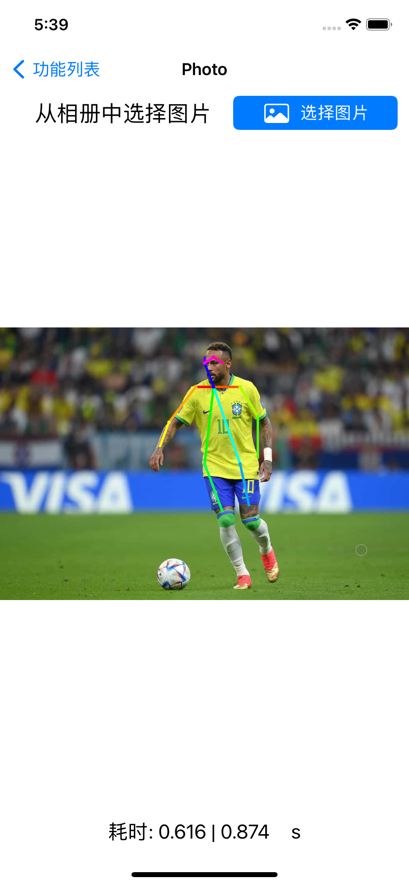
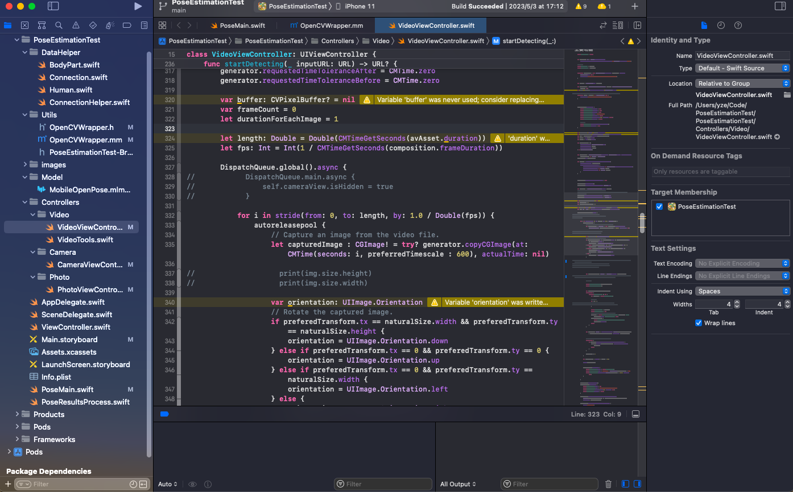
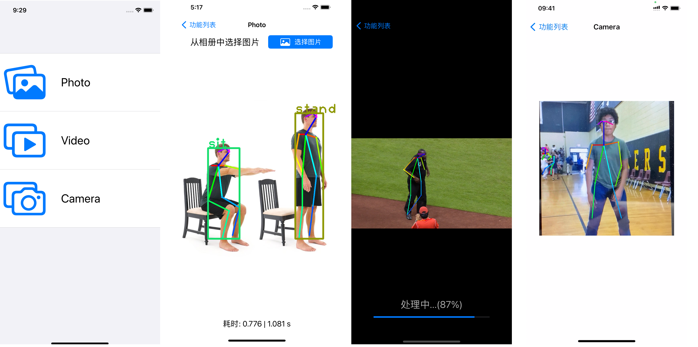

This is a mobile pose estimation application based on swift and CoreML.





This application outputs the stickman-like pose visualization results from resources:

- Pictures in users's Photo Library.
- Videos in users's Photo Library.
- Camera views from users back camera. 


## Installation

```sh
git clone git@github.com:yydrowz3/ios-pose-animator.git
cd ios-pose-animator
pod install
```

## Demo

### demo screenshots



### demo video


## Model

In this project, we use available public model and convert it to CoreML format for pose estimation. 

For model Convertion, please refer to:

- [OpenPose Caffe-Model Convertion](https://github.com/infocom-tpo/SwiftOpenPose/blob/master/doc/CaffeToMLModel.md)
- [OpenPose TensorFlow-Model Convertion (MobileNet)](https://github.com/infocom-tpo/tf-openpose/tree/master/convert)

After convertion, place the model file inside the `./Model/` folder. 

## Develop Environment

- IOS 16.2
- XCode 14.2
- Swift 5.7
- CocoPods 1.12.0

### Dependency Library

- [UpSurge](https://github.com/alejandro-isaza/Upsurge)
- [OpenCV](https://opencv.org/releases/)

In this project, we use *CocoPods* to manage dependencies. 


## Reference

- [OpenPose](https://github.com/CMU-Perceptual-Computing-Lab/openpose)
- [CoreML model convertion](https://gist.github.com/otmb/7b2e1caf3330b97c82dc217af5844ad5)
- [Stickman Animator](https://github.com/infocom-tpo/SwiftOpenPose?tab=readme-ov-file)


## License

This pose animator application is available under the MIT license. See the LICENSE file for more information.  

